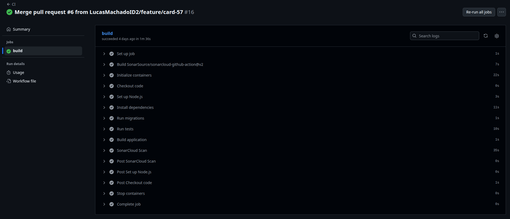
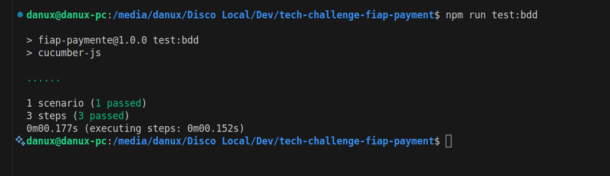

# Payment Microservice - Tech Challenge FIAP

## 📖 Sobre o Projeto

Este é o microsserviço de pagamentos, sua principal responsabilidade é gerenciar todo o ciclo de vida de uma transação de pagamento.

Ele se integra a um provedor de pagamentos externo (Mercado Pago) para processar as transações, armazena o status e os detalhes de cada pagamento em um banco de dados PostgreSQL e expõe uma API para que outros microsserviços possam iniciar pagamentos e consultar seu status. Além disso, ele lida com notificações (webhooks) do provedor para atualizar o status do pagamento em tempo real (por exemplo, de 'pendente' para 'aprovado') e notifica outros sistemas quando um pagamento é concluído com sucesso.

## 🧪 Evidências dos Testes Executados

O projeto possui uma suíte completa de testes automatizados que garantem a qualidade e confiabilidade do código. Os testes são executados em diferentes camadas da aplicação:

### 📋 Tipos de Testes Implementados

- **🔬 Testes Unitários (Jest)**: Testam funções e métodos isoladamente

  - Controllers: Validação da lógica de entrada/saída
  - Services: Regras de negócio e integrações
  - Repositories: Operações de banco de dados
  - Utils: Funções auxiliares e helpers

- **🎭 Testes BDD (Cucumber)**: Testes de comportamento em linguagem natural

  - Cenários de criação de pagamentos
  - Fluxos end-to-end da API
  - Validação de requisitos funcionais

- **📊 Cobertura de Código**: Relatórios detalhados de cobertura
  - Análise de linhas, funções e branches testadas
  - Identificação de código não coberto por testes
  - Garantia de qualidade mínima exigida

### 🏆 Resultados dos Testes

Todos os testes automatizados foram executados com **100% de sucesso**:

_Execução dos testes unitários com Jest_


_Pipeline executado com sucesso_



_Execução dos testes BDD com Cucumber_



## 🧩 Estrutura de Endpoints do Microsserviço de Pagamentos

| Método | Endpoint            | Descrição                                                    |
| ------ | ------------------- | ------------------------------------------------------------ |
| `POST` | `/payments`         | Cria um novo pagamento.                                      |
| `GET`  | `/payments`         | Consulta todos os pagamentos.                                |
| `POST` | `/payments/webhook` | Recebe notificações do provedor de pagamento (Mercado Pago). |

## 🏛️ Arquitetura em Camadas

O projeto segue uma arquitetura em camadas para organizar o código, promover a separação de responsabilidades e facilitar a manutenção e escalabilidade. Cada camada tem um papel bem definido:

1.  **Rotas (Routes)**: Localizada em `src/routes/`, esta é a camada de entrada da API. Ela define os endpoints HTTP (ex: `/payments`) e os direciona para os controladores correspondentes.

2.  **Controladores (Controllers)**: Em `src/controllers/`, os controladores atuam como intermediários. Eles recebem as requisições HTTP da camada de rotas, extraem os dados (body, params, query) e invocam os métodos da camada de serviço. Ao final, formatam a resposta HTTP (sucesso ou erro) para o cliente.

3.  **Serviços (Services)**: A camada de `src/services/` contém a lógica de negócio principal da aplicação. Ela orquestra as operações, como a comunicação com a API externa do Mercado Pago, a validação das regras de negócio e a coordenação com a camada de repositório para persistir os dados.

4.  **Repositórios (Repositories)**: Em `src/repositories/`, esta camada é responsável exclusivamente pela comunicação com o banco de dados. Ela abstrai a lógica de acesso aos dados (CRUD - Create, Read, Update, Delete), permitindo que o resto da aplicação interaja com os dados sem conhecer os detalhes da implementação do banco (neste caso, usando o Prisma).

5.  **Modelos (Models)**: Os arquivos em `src/models/` definem as estruturas de dados e tipos (DTOs - Data Transfer Objects) que são utilizados para trafegar informações entre as camadas, garantindo consistência e clareza.

Esse fluxo unidirecional (Rota → Controlador → Serviço → Repositório) torna o sistema mais previsível e fácil de testar.

## 🚀 Tecnologias Utilizadas

Este projeto foi construído com as seguintes tecnologias e ferramentas:

- **Node.js**: Ambiente de execução para o JavaScript no servidor.
- **TypeScript**: Superset do JavaScript que adiciona tipagem estática ao código.
- **Express.js**: Framework web para a construção da API REST.
- **Prisma**: ORM (Object-Relational Mapper) para a comunicação com o banco de dados.
- **PostgreSQL**: Banco de dados relacional utilizado para persistir os dados dos pagamentos.
- **Mercado Pago SDK**: Biblioteca oficial para integração com a API de pagamentos do Mercado Pago.
- **Docker & Docker Compose**: Ferramentas para containerização da aplicação e do banco de dados, facilitando o ambiente de desenvolvimento.
- **Kubernetes**: Orquestrador de containers para deploy e gerenciamento da aplicação em um ambiente de produção.
- **Cucumber & Gherkin**: Para a escrita de testes de aceitação seguindo a metodologia BDD (Behavior-Driven Development).
- **Jest & Supertest**: Framework de testes e biblioteca para testar os endpoints da API.

## ✅ Pré-requisitos

Antes de começar, certifique-se de ter as seguintes ferramentas instaladas e configuradas em seu ambiente:

- **Docker**: Para criar e gerenciar os contêineres da aplicação e do banco de dados localmente.
- **Kubernetes**: Um cluster Kubernetes para o deploy. Pode ser um cluster local como [Minikube](https://minikube.sigs.k8s.io/docs/start/) ou o Kubernetes integrado ao Docker Desktop.
- **kubectl**: A ferramenta de linha de comando do Kubernetes, configurada para interagir com seu cluster.

## 🚀 Como executar

1. Clone o repositório:

```bash
git clone https://github.com/LucasMachadoID2/tech-challenge-fiap-product.git
```

2. Inicie o Minikube:

```bash
minikube start
```

3. Aplique os recursos do K8S, acesse a pasta '/terraform' e execute o comando:

```bash
kubectl apply -f .
```

4. verifique o status dos recursos:

```bash
kubectl getAll
```

4. Recursos

```bash
http://ip-da-sua-maquina-aqui:30001/payments #API
http://ip-da-sua-maquina-aqui:30001/api-doc #Swagger
http://ip-da-sua-maquina-aqui:30002 #Prisma
```

## Comando úteis para teste local

## API k8s

```bash
# Verificar k8s rodando
watch kubectl get all

# remover volume do docker
docker compose down -v

# verificar logs do container
docker compose logs -f api

# derrubar k8s
kubectl delete -f .

```

## API local

```bash
# Iniciar API
npm run start:watch

# Subir o banco de dados com Docker
docker compose up -d --build

# Resetar dados do prisma
npx prisma migrate reset

# Rodar as migrations do Prisma
npx prisma migrate dev --name init

# Abrir o Prisma Studio
npx prisma studio

# Gerar imagem e enviar docker hub
docker build -t danilloagt/fiap-payment:latest .
docker push danilloagt/fiap-payment:latest

http://localhost:3333/payments #API
http://localhost:3333/api-docs #Swagger
http://localhost:5555 #Prisma


```
